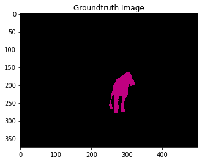

# Image Denoising
| .png) | 
|:--:| 
| *Image before Denoising* |

|  | 
|:--:| 
| *Denoised this image with the pre-trained model* |

|  | 
|:--:| 
| *Denoised this image using the fine-tuned model* |

|  | 
|:--:| 
| *Added noise to this image using the fine-tuned model* |

# Semantic Segmentation
|  | 
|:--:| 
| *Original Image* |

|  | 
|:--:| 
| *Original Image with predicted segmentation mask * |

|  | 
|:--:| 
| *Mask Image from the Original Image* |

|  | 
|:--:| 
| *Ground Truth Image from the Mask Image* |
